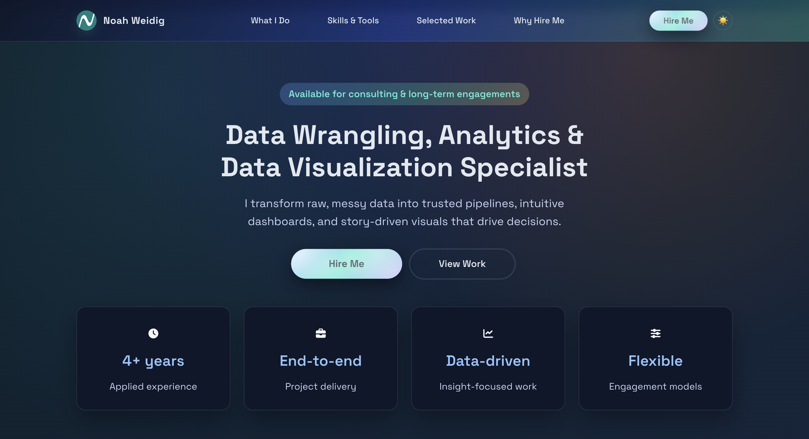

<div align="center">



<br/>
<br/>

# Hire Noah

**A polished, accessible "hire me" page for a Data Wrangling, Analytics & Visualization specialist.**

[](https://developer.mozilla.org/en-US/docs/Web/HTML)
[](https://developer.mozilla.org/en-US/docs/Web/CSS)
[](https://developer.mozilla.org/en-US/docs/Web/JavaScript)
[](https://www.python.org/)
[](LICENSE)

[View Live](https://noahweidig.com) · [Hire Me](https://forms.gle/UCx9wFKc7UuAMTME6) · [Report a Bug](https://github.com/noahweidig/hire/issues)

</div>

---

## Overview

This is the source code for Noah Weidig's personal "hire me" page — a single-page, fully responsive website built from scratch with vanilla HTML, CSS, and JavaScript. No frameworks. No dependencies. Just clean, performant, accessible web standards.

The page is designed to make a strong first impression on potential clients and hiring managers: a bold hero, a continuous skills marquee, a curated work showcase, and a clear call to action.

---

## Features

- **Dark mode toggle** — Smooth theme switching with `prefers-color-scheme` support and `localStorage` persistence
- **Sticky navigation** — Accessible nav bar with skip-link and keyboard-friendly focus styles
- **Animated skills marquee** — Three rows of scrolling skill tags at staggered speeds, with `prefers-reduced-motion` support
- **Intersection Observer animations** — Cards and sections fade in as they enter the viewport, with no layout thrashing
- **Back-to-top button** — Appears only after scrolling past the hero; powered by a sentinel element + IntersectionObserver
- **Strong Content Security Policy** — No inline styles or handlers; CSP headers enforced at the meta level
- **Print styles** — Linearized layout and hidden interactive elements so recruiters can print or save a clean PDF
- **Fully accessible** — ARIA labels, skip links, semantic HTML, and tested keyboard navigation throughout

---

## Tech Stack

| Layer      | Technology                                      |
|------------|-------------------------------------------------|
| Markup     | HTML5, semantic elements, ARIA                  |
| Styling    | CSS3, custom properties, `@media` queries       |
| Behavior   | Vanilla JavaScript (ES6+), IntersectionObserver |
| Fonts      | Space Grotesk via Google Fonts                  |
| Testing    | Python · pytest · Playwright                    |

---

## Project Structure

```
hire/
├── index.html              # Main single-page application
├── styles.css              # All styles — layout, theme, animations, print
├── script.js               # Theme toggle, scroll behavior, back-to-top
├── nw-logo.png             # Brand logo (favicon + nav)
├── verification_hero.png   # Hero screenshot used in this README
├── assets/
│   └── icons/              # Inlined SVG icons (chart, briefcase, clock, sliders)
├── tests/
│   ├── test_theme.py           # Dark/light mode persistence
│   ├── test_scroll_behavior.py # IntersectionObserver + back-to-top
│   ├── test_marquee.py         # Skills marquee animation
│   ├── test_back_to_top.py     # Back-to-top button visibility
│   ├── test_external_links.py  # Link targets and rel attributes
│   └── test_security_headers.py# CSP and referrer policy
└── requirements.txt        # Python test dependencies
```

---

## Running Tests

### Prerequisites

- Python 3.9+
- [pip](https://pip.pypa.io/)

### Install

```bash
pip install -r requirements.txt
playwright install chromium
```

### Run

```bash
pytest tests/
```

Tests spin up a local server, open the page in a headless Chromium browser, and assert behavior across all major feature areas.

---

## Local Development

No build step required. Just open `index.html` in your browser:

```bash
# Option 1 — Python
python -m http.server 8000

# Option 2 — Node
npx serve .
```

Then visit `http://localhost:8000`.

---

## Accessibility

This page is built to meet **WCAG 2.1 AA** standards:

- All interactive elements are keyboard-navigable with visible focus rings
- Color contrast ratios exceed 4.5:1 in both light and dark themes
- Images carry meaningful `alt` text; decorative elements use `aria-hidden`
- Skip link provided for screen reader and keyboard users
- Marquee region exposes `role="region"` and `aria-label` with a `tabindex` for keyboard access

---

<div align="center">

Built with care by **[Noah Weidig](https://noahweidig.com)** · Data Wrangling & Visualization

</div>
